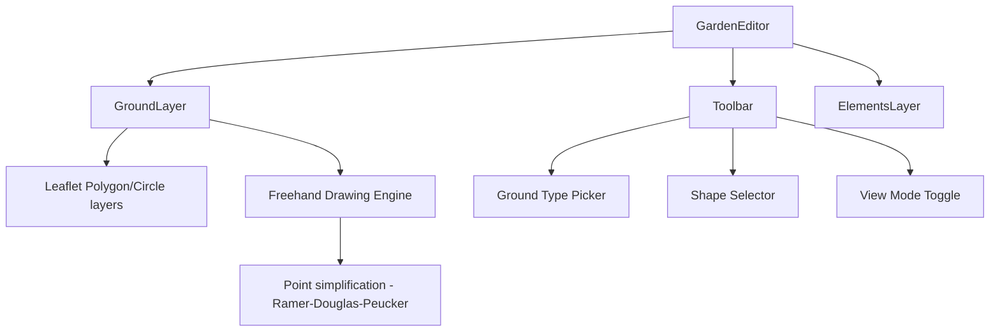

# Ground Layer Editor

## Overview

Add a "ground layer" to the garden editor where users can mark regions of their garden with surface types (bed, grass, path, water, building). Users can draw using freehand brush strokes or geometric shapes (rectangle, circle, triangle). A view mode toggle switches between filled regions and outline-only display so the satellite background remains visible.

## Ground Types

| Type     | Color   | Description          |
|----------|---------|----------------------|
| bed      | #8B4513 | Brown - planting beds |
| grass    | #4CAF50 | Green - lawn areas   |
| path     | #9E9E9E | Grey - walkways      |
| water    | #2196F3 | Blue - ponds/streams |
| building | #212121 | Black - structures   |

## Drawing Modes

1. **Freehand brush** — smooth paint-like stroke that records points as the user drags, then simplifies into a polygon
2. **Rectangle** — click-drag to define a rectangle
3. **Circle** — click-drag from center to edge
4. **Triangle** — click three points

## View Modes

- **Filled** (default): regions rendered with ~50% opacity fill + colored border
- **Outline-only**: regions rendered with colored border only (no fill), so the satellite image shows through clearly

## Data Model

```typescript
export type GroundType = "bed" | "grass" | "path" | "water" | "building";

export interface GroundRegion {
  id: string;
  type: GroundType;
  /** Shape type for rendering hints */
  shape: "freehand" | "rectangle" | "circle" | "triangle";
  /** Polygon points as [x, y] canvas coordinates (for all shapes) */
  points: number[][];
  /** For circles: center and radius */
  center?: { x: number; y: number };
  radius?: number;
  createdAt: Date;
}
```

The `Garden` model gets a new field:
```typescript
export interface Garden {
  // ... existing fields
  groundRegions: GroundRegion[];
}
```

## Architecture



## Layer Ordering (bottom to top)

1. Satellite background image (ImageOverlay)
2. **Ground regions layer** (polygons/circles with fill or outline)
3. Border polygon (dashed green)
4. Elements layer (plant markers, notes, etc.)

## Toolbar UX

The toolbar gets a new "Ground" mode. When active:
- A **sub-toolbar** appears above the main toolbar showing:
  - Ground type buttons: 🟫 Bed | 🌿 Grass | 🛤️ Path | 💧 Water | 🏠 Building
  - Shape buttons: ✏️ Freehand | ▭ Rectangle | ⬭ Circle | △ Triangle
- A **view toggle** button in the main toolbar: 🎨 (filled) / ⬡ (outline)

## Freehand Drawing Engine

Since Leaflet doesnt have native freehand drawing:
1. When freehand mode is active, attach `mousedown/touchstart` → start recording
2. On `mousemove/touchmove` → collect points, draw temporary polyline
3. On `mouseup/touchend` → simplify points using Ramer-Douglas-Peucker algorithm, close polygon, create GroundRegion
4. Convert to Leaflet Polygon and add to ground layer

Point simplification is important for performance (reduce hundreds of raw touch points to ~20-50 meaningful vertices).

## Persistence

- Ground regions stored in `garden.groundRegions[]` array
- Saved to IndexedDB via existing `updateGarden()` store function
- Auto-save after each draw/edit/delete operation (debounced 500ms)

## Edit/Delete Flow

- In "select" mode, clicking a ground region selects it (highlighted border)
- Selected region shows:
  - Delete button (trash icon)
  - Type change dropdown
  - Vertex editing (drag points to reshape) — for freehand/polygon shapes
  - Resize handles — for rectangle/circle

## Files to Create/Modify

### New Files
- `src/components/GardenEditor/GroundLayer.tsx` — renders all ground regions as Leaflet layers
- `src/components/GardenEditor/GroundDrawing.ts` — freehand drawing engine + point simplification
- `src/components/GardenEditor/GroundToolbar.tsx` — sub-toolbar for ground type + shape selection
- `src/components/GardenEditor/GroundToolbar.module.css`
- `src/components/GardenEditor/ground-types.ts` — ground type definitions (colors, labels, icons)

### Modified Files
- `src/models/garden.ts` — add `GroundType`, `GroundRegion` interfaces, update `Garden`
- `src/models/index.ts` — export new types
- `src/components/GardenEditor/GardenEditor.tsx` — integrate GroundLayer, handle ground drawing modes
- `src/components/GardenEditor/Toolbar.tsx` — add "Ground" tool + view mode toggle
- `src/stores/garden.store.ts` — add ground region CRUD operations
- `src/services/garden.service.ts` — ensure `groundRegions` is persisted
- `src/db/adapter.ts` — no changes needed (already stores full garden object)

## Implementation Order

1. Extend data model with `GroundRegion` type
2. Create `ground-types.ts` with color/icon definitions
3. Create `GroundLayer.tsx` — render existing regions as Leaflet polygons/circles
4. Add view mode toggle (filled vs outline-only)
5. Integrate `leaflet-draw` for rectangle/circle/triangle shape tools
6. Implement freehand drawing engine with point simplification
7. Create `GroundToolbar.tsx` sub-toolbar UI
8. Wire toolbar to GardenEditor drawing state
9. Add persistence (auto-save ground regions)
10. Implement select/edit/delete for existing shapes
